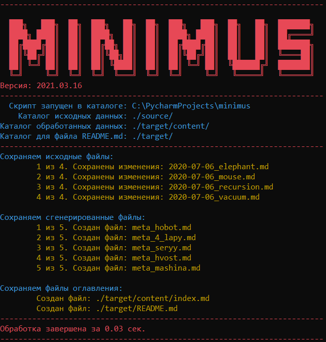

# Minimus

Инструмент для ведения заметок по методу **Zettelkasten**.

В двух словах:

1. Пишете заметки в текстовых файлах, указываете в них теги.
1. Запускаете **minimus**.
1. Получаете сшивку связей в ваших заметках.

## Что за **Zettelkasten**?

Этот метод был придуман немецким социологом
[Никласом Луманом](https://ru.wikipedia.org/wiki/%D0%9B%D1%83%D0%BC%D0%B0%D0%BD,_%D0%9D%D0%B8%D0%BA%D0%BB%D0%B0%D1%81)
.

Метод строится на применении упорядоченного набора листков бумаги. Каждый
листок должен быть пронумерован и содержать одну специфическую идею. Листки
могут содержать ссылки друг на друга и обобщающие теги. Все листки хранятся в
пронумерованных ящиках, за счёт чего листок с любым номером можно быстрой
найти.

Основные идеи:

1. Отсутствие категорий. Информация в системе хранится в виде графа, введение
   каких-либо категорий не предусматривается. За счёт этого проще добавлять
   информацию, не имеющую чётко определённой области.
2. Отсутствует проблема переполнения данными. Система работает тем лучше, чем
   больше в ней информации.
3. Желательно использование максимально примитивных технологий. Предполагается,
   что система создаётся один раз и на всю жизнь, поэтому не должно быть
   зависимости от конкретного приложения, формата или чего-то подобного.
4. Желательно максимальное количество ссылок в системе. Информация, не
   сцепленная с другими заметками, скорее всего будет бесполезна.
5. Ничего не удаляется. При пересмотре содержимого лучше добавлять заметки,
   описывающие, почему предыдущие были неправильными.

Набор этих простейших правил создаёт очень удобную и максимально живучую
систему сохранения знаний.

## Для чего это приложение

Чтобы было удобнее вести заметки. Оно сшивает заметки по тегам. Ещё он умеет
создавать дополнительные страницы для тегов, чтобы было понятно, где они
упоминаются. Предполагается, что архив заметок будет лежать в сетевом хранилище
вроде Yandex Disk / Google drive / Dropbox. Для работы не требуются сторонние
приложения и интернет.

Желательно при этом, чтобы каталог контролировался системой контроля версий,
например git.

## Как пользоваться

1. Надо иметь на машине установленный python не версией старше 3.10.
2. Клонировать репозиторий.
3. Создать окружение, подготовить проект к запуску.
4. Положить свои заметки в каталог source\content.

Для windows:

```shell
git clone git@github.com:IgorZyktin/minimus.git
cd minimus
python -m venv -venv
venv\scripts\activate
pip install -r requirements.txt
python -m minimus --source <папка заметок> --target <папка результатов>
```

Для linux:

```shell
git clone git@github.com:IgorZyktin/minimus.git
cd minimus
python -m venv -venv
source venv/bin/activate
pip install -r requirements.txt
python -m minimus --source <папка заметок> --target <папка результатов>
```

Не забудьте, что в исходном каталоге заметки должны лежать в папке content.

### Начало работы

Надо создать несколько текстовых файлов с заметками в формате markdown.
Расширение файлов должно быть ".md".

Желательный формат заметок:

```markdown
# Мышь

Маленькое млекопитающее.

---

Теги:

- Хвост
- 4 лапы
- Серый

---

Живёт почти везде.
```

Важно, чтобы в документе была секция между двух блоков ---.

После этого можно запускать minimus. Если всё пройдёт хорошо, выходной текст
будет:

```markdown
# Мышь

Маленькое млекопитающее.

---

Теги:

- [Хвост](../_tags/Хвост.md)
- [4 лапы](../_tags/4%20лапы.md)
- [Серый](../_tags/Серый.md)

---

Живёт почти везде.
```

Видно, что сам текст заметки остался тем же, но теперь теги это не просто
текст, а реальные ссылки на другие документы.

Нормальный вывод программы выглядит примерно вот так:


### Аргументы запуска

Ключ | Значение
:--------------------------------------:|:-----------------------------------:
--source "C:\my cool folder"  | Каталог исходных данных
--target "C:\my cool folder"  | Каталог для сохранения

### Развёртывание

Я храню на компьютере bat файл со скриптом запуска. Он позволяет мне быстро
пересобрать новую версию заметок.

```batch
@ECHO off
SET source="C:\Users\MainUser\YandexDisk\zettelkasten_source"
SET target="C:\Users\MainUser\YandexDisk\zettelkasten_target"

cd "C:\PycharmProjects\minimus"
call "C:\PycharmProjects\minimus\venv\Scripts\activate.bat"

python -m minimus --source %source% --target %target%

(echo Данный репозиторий был собран с помощью проекта Minimus: https://github.com/IgorZyktin/minimus) > "%target%\README.md.tmp"
echo: >> "%target%\README.md.tmp"
type "%target%\README.md" >> "%target%\README.md.tmp"
move /y "%target%\README.md.tmp" "%target%\README.md"

PAUSE
EXIT
```

### Справочные данные

1. Подробнее про **Zettelkasten**:
    * http://vonoiral.com/all/zettelkasten/

1. Подробнее про **python** (на этом языке написан линковщик):
    * https://pythonworld.ru/osnovy/skachat-python.html
    * Скачать тут: https://www.python.org/ftp/python/3.10.0/python-3.10.0-amd64.exe

1. Подробнее про **typora** (я применяю этот markdown редактор):
    * https://typora.io/
    * Скачать https://typora.io/#windows
    * Скачать https://typora.io/#linux
